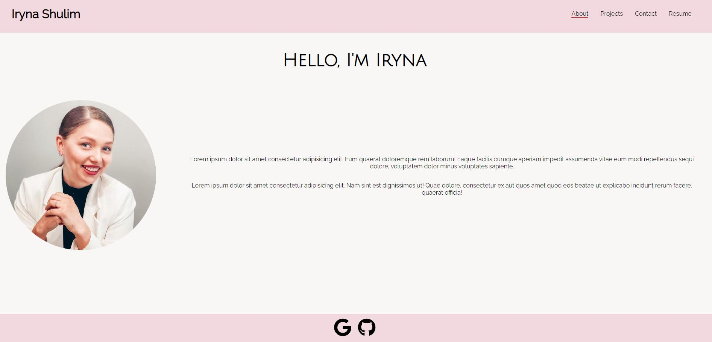

# Iryna Shulim React Portfolio 

## Description

Portfolio website completed in React

## Table of Contents

- [Installation](#installation)
- [Usage](#usage)
- [License](#license)

## Installation

Click on the link.

## Usage

Please click on the link bellow to be directed to the site. Once there you can view examples of my work, my resume and contact me directly from the site.

## License

### MIT

This application is covered under the MIT license. To learn more about this license,
please click the link. [MIT](https://choosealicense.com/licenses/mit/)

## Screenshot

## Questions
[Deployed App](https://irynashulim.github.io/is-portfolio/)

[GitHub page](https://github.com/irynashulim/is-portfolio)

Email Address: iryna.shulim@gmail.com

